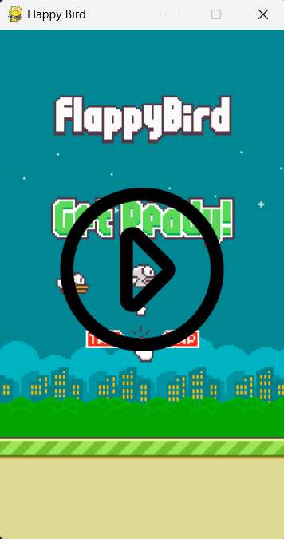
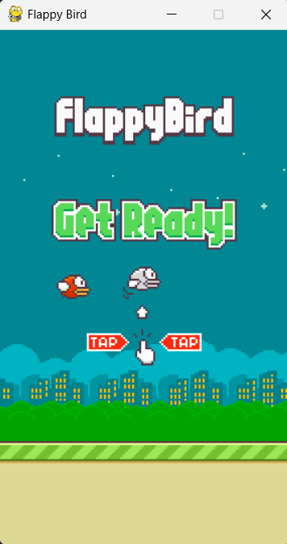
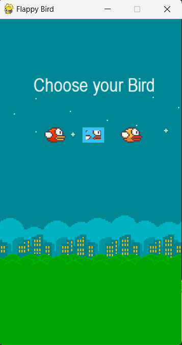
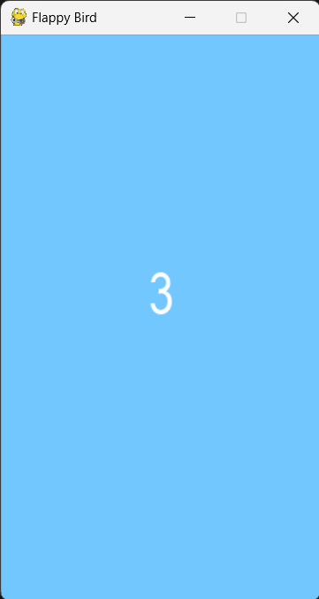
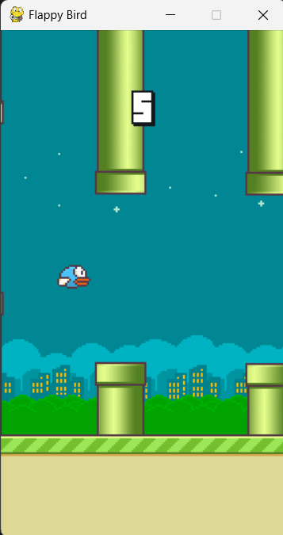
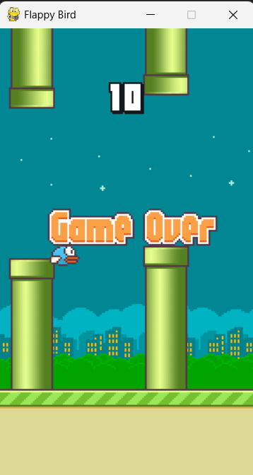

# Flappy Bird Game

This is a 2D **Flappy Bird Game** created using **Python** and **Pygame**. The objective of the game is to navigate a bird between pipes by making it "flap" using the spacebar or the up arrow. The game ends when the bird hits the ground or a pipe.

### Features
- **Choose Bird**: Choose your favourite bird and Press Enter to begin the game.
- **Countdown**: The game will begin with the counter of 3-2-1.
- **Bird Control**: Press **Space** or **Up Arrow** to make the bird flap and rise.
- **Random Pipe Generation**: Pipes appear at random heights and move from right to left.
- **Collision Detection**: The bird collides with pipes or the ground to end the game.
- **Scoring**: The score increases as the bird successfully navigates through pipes.
- **Game Over Screen**: The game shows a "Game Over" screen when the player hits an obstacle.

### Game Controls
- **Spacebar** or **Up Arrow**: Flap the bird to rise.
- **Escape**: Exit the game at any time.

### Installation

1. **Clone the repository**:
    ```bash
    git clone https://github.com/yourusername/flappy-bird-game.git
    ```
2. **Navigate to the project directory**:
    ```bash
    cd flappy-bird-game
    ```
3. **Install Pygame** (if not already installed):
    ```bash
    pip install pygame
    ```
4. **Run the game**:
    ```bash
    python game.py
    ```

### Game Preview

#### Gameplay Video

<!-- Resize using markdown image syntax with width parameter -->
<a href="assets/videos/flappy-bird-gameplay.mp4">
    
</a>

#### Screenshots



Homescreen



Choose your bird



Counter 3-2-1



Gameplay



GameOver

### Credits
- **Images**: All assets (bird, pipes, background, etc.) used in the game are sourced from free resources and custom-made images.
- **Sounds**: Sounds are used to enhance the gameplay experience.

### License
This project is open-source and available under the **Creative Commons 1.0 (CC0) License**.

---

Feel free to contribute by forking the repository and submitting pull requests. Enjoy playing the game!
